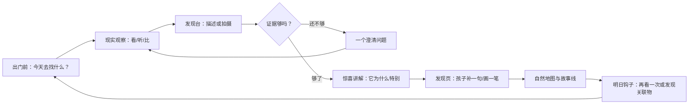
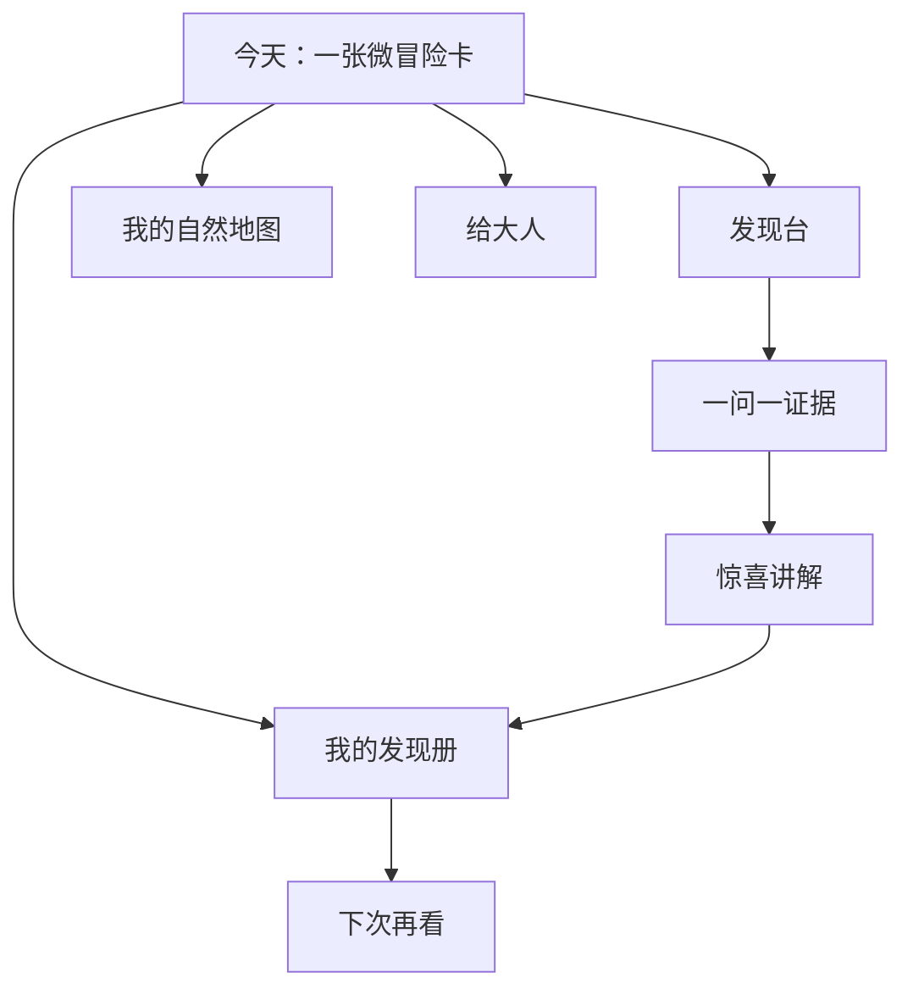

# 儿童自然探索体验规格（v1）

## 1. 产品北极星

**让一个孩子在回家路上愿意慢下来，认真看一眼身边的生命，并带着一个自己的发现回家。**

nature-dex 不是“把物种名称告诉孩子”的百科，也不是要求打卡的学习工具。它是一位不抢走注意力、而是把注意力还给真实世界的探索伙伴。

### 北极星体验

一个 7 岁孩子放学经过小区花坛：

1. 首页只给一张“今天的发现卡”：“找一片**边缘不一样**的叶子”。
2. 孩子看到黄色小花，点“我发现了”，可以拍照、说话或直接选择“黄黄的 / 长在草地上”。
3. 系统不急于下结论，而是说：“它很像蒲公英。我想请你帮我确认一件事：叶子是不是贴着地面长？”
4. 孩子完成观察后得到“你发现了一个会变装的植物：黄花以后可能会变成白绒球”。
5. 记录自动生成一张“今天的发现页”，孩子可以画一笔、录一句声音或贴一颗心情贴纸。
6. 第二天系统记得这个故事：“昨天的小太阳花，今天有没有换成白绒球？”

孩子完成的不是“查询”，而是一段**发现 → 证据 → 惊喜 → 留下故事 → 再见面**的体验。

---

## 2. 设计原则：儿童优先而非成人任务优先

| 原则 | 产品含义 | 不应发生的事 |
|---|---|---|
| 真实世界第一 | 每屏都引导孩子看、听、比较、等待，而不是盯着屏幕。 | 让孩子在室内连续刷动物卡。 |
| 先好奇，后命名 | 未知是探索的正常状态；先描述特征，再给候选。 | 把“没识别出来”表现成失败。 |
| 一个小目标 | 每次出门只给 1 个主任务和最多 2 个可选支线。 | 堆满待办、连续弹窗和复杂分类。 |
| 发现有证据 | 每个“我发现了”都至少包含地点、一个特征或一段原始描述。 | 只有点击就能收集的虚假成就。 |
| 孩子拥有叙事权 | 系统起草日记，孩子可用画、语音、贴纸改写。 | AI 把儿童经历写成成人腔的报告。 |
| 永远安全且不羞辱 | 不确定、跳过、做错都可以；风险提示简短、行动明确。 | 红色警告轰炸或诱导接触野生生物。 |
| 低刺激、可停下 | 色彩服务于观察；没有无限滚动、倒计时、排名或付费诱导。 | 用积分、连续签到制造焦虑。 |

### 内容语言规范

- 对 4–6 岁：一句话不超过一个观察动作，例如“看看叶子像不像小手掌”。
- 对 7–9 岁：使用“我猜你发现了……，证据是……”的探案语言。
- 对 10 岁以上：补充分类、生态关系与“我如何验证”的方法。
- 使用可爱的比喻，但必须保留事实边界。例如“种子像在旅行”，而不是“花故意骗人”。
- 绝不鼓励采摘、投喂、抓捕、触摸未知生物或靠近水边、鸟巢与流浪动物。

---

## 3. 用户与使用情境

### 主用户：4–10 岁孩子

| 年龄段 | 关键能力与阻力 | 适合的交互 |
|---|---|---|
| 4–6 岁 | 识字有限；需要即时、具体的感官提示；通常有成人陪伴。 | 大图标、颜色/形状二选一、语音、30 秒微任务。 |
| 7–9 岁 | 能独立完成短任务；喜欢角色、收集和“我自己发现”。 | 探案问题、证据卡、地图贴纸、可选故事标题。 |
| 10 岁+ | 开始喜欢系统、比较、因果和自主挑战。 | 观察笔记、相似物种对照、季节追踪、小实验设计。 |

### 次用户：家长

家长不是“监督员”，而是安全边界的共同维护者。家长视图需回答三件事：

1. 孩子今天观察了什么、说了什么？
2. 哪些观察值得在现实里追问，而不是由系统直接讲完？
3. 是否有安全、隐私或地点分享需要处理？

### 三个高频时刻

1. **出门前 30 秒**：选择今天的微冒险。
2. **路上 2–5 分钟**：观察、拍摄、语音描述、确认候选。
3. **回家后 1 分钟**：把发现变成自己的故事，并获得温和的明日钩子。

---

## 4. 核心体验循环：一场小小的自然冒险



### 4.1 今日微冒险（入口，而非功能菜单）

首页只展示一个由季节、地点、年龄、近期记录共同决定的主任务：

- **任务名**：寻找会变装的小太阳。
- **一句任务**：在草地边找黄色的小花；只看，不摘。
- **成功证据**：看见黄色花、贴地叶或白色绒球之一。
- **时长**：约 3 分钟。
- **替代路线**：没看到花？找一片边缘有锯齿的叶子也算完成。

任务卡必须有“换一个”“今天不做”按钮。跳过不损失徽章、连续天数或等级。

### 4.2 发现台（识别的儿童化入口）

孩子可任选一种输入，界面默认只呈现大按钮：

- **拍一拍**：图片候选；图像质量不够时给拍摄建议，不假装识别。
- **说一说**：语音转文字后显示“我听到你说……”，允许孩子改正。
- **选一选**：颜色、大小、在哪里、会不会动等短选项。
- **画一画**：先存为发现草稿，后续可由孩子或家长补充。

系统响应遵循固定节奏：

> 我猜你遇到了 **蒲公英**。\
> 因为你说它是**黄色小花**，还长在**草地边**。\
> 你愿意帮我看最后一个线索吗：叶子是不是贴着地面？

显示“像它的程度”时用语言和 3 档图形，而不是精确百分比：`刚开始猜 / 很像 / 已经确认`。精确置信度仅供技术与家长视图。

### 4.3 一问一证据（澄清，不是问卷）

- 每轮最多问 1 个问题；最多连续 2 轮。
- 问题必须能在眼前看到、听到或安全完成。
- 提供“不知道”“先记下来”选项。
- 证据不足时保存“神秘发现”，并鼓励明天或与家长一起再看；不能降级为错误提示。

### 4.4 惊喜讲解（知识的奖励时刻）

每次确认只讲三层，孩子可以主动展开：

1. **惊喜句**：一个具体、有画面的事实。
2. **再看一眼**：下一步真实观察行动。
3. **守护提醒**：必要时出现，且说明动作。

以蒲公英为例：

- 惊喜句：“它的黄花谢了以后，可能会变成白白的小伞兵。”
- 再看一眼：“下次经过时，看它是不是换了新衣服。”
- 守护提醒：“只用眼睛看，不摘它；这样别的小虫也能来拜访。”

### 4.5 我的发现页（故事大于收藏）

每条记录是一页可回看的“发现页”，固定结构：

- `我在哪里发现的`：地点图标或家长设置的模糊地点。
- `我看到的证据`：图、声音、颜色或特征。
- `我想说`：孩子可选语音、涂鸦、贴纸、短句；全部可跳过。
- `它的秘密`：已确认后显示的惊喜句。
- `下次再看`：一个温和的时间性问题，例如“它会不会换衣服？”

系统只能**起草**故事，默认展示“你想这样写吗？”，不能直接替孩子发布。

---

## 5. 信息架构与页面规格

移动端优先；孩子端采用四个一级入口，始终可在两次点击内回到首页。



### A. 今天（默认首页）

**目标**：让孩子 5 秒内理解“今天可以做什么”。

- 顶部：天气/季节感知图标，避免要求精确定位。
- 中间：唯一主任务卡；卡片不超过 60 个汉字。
- 底部：`我发现了`、`换一个`、`今天先不探索`。
- 弱网或无账户：任务仍可本地完成，后续再保存。

### B. 发现台

**目标**：降低“我不会描述”的挫败感。

- 输入方式并列，不默认要求拍照或注册。
- 每次只展示一个选择维度：颜色 → 地点 → 特征。
- 随时显示“先记为神秘发现”。
- 识别结果以“候选朋友”而非“答案列表”呈现，最多 3 个。

### C. 我的自然地图

**目标**：让积累有意义，不形成比较压力。

- 用“探索区域”代替精确地理位置：家、学校路上、公园、水边。
- 每一个区域是一片会逐渐丰富的生态拼图，不显示全国排名。
- 只展示孩子自己发现过、或已允许解锁的关联物种。
- 默认不共享；家长可导出一张月度回顾卡。

### D. 我的发现册

**目标**：把零散记录连接为孩子自己的自然故事。

- 时间线按“今天 / 这周 / 这个季节”切换。
- 相同物种的多次记录自动连成“再见面”故事线。
- 系统提议比较，不替孩子给出结论：
  - “第一次看到黄色花，第二次看到白绒球。你觉得发生了什么？”
- 允许孩子收藏“最喜欢的三次发现”；不采用稀有度或炫耀性等级。

### E. 给大人

**目标**：提供信任、安全设置与共学脚手架。

- 今天的发现摘要：原始孩子表达与系统解释分开显示。
- 安全说明：有风险时显示原因、动作和何时需要成人协助。
- 隐私设置：图片保存、地点模糊化、分享与删除。
- 共学问题：如“你可以问：你觉得它为什么喜欢这里？”

---

## 6. 叙事系统：四季自然护照

### 主叙事

孩子不是在完成课程，而是在制作自己的**四季自然护照**。每一页记录一个真实发现；季节变化把单页连接成长期故事。

- 春：`醒来的花园`——新芽、花、鸟巢附近的远观。
- 夏：`热闹的声音`——蝉、蜻蜓、雨后生物。
- 秋：`会换衣服的树`——种子、果实、叶色。
- 冬：`安静但没有消失`——常绿树、鸟、树皮与天气痕迹。

叙事的“角色”是孩子发现的真实物种，不创造会命令孩子、代替真实观察的虚构吉祥物。可以使用一个低存在感的“自然笔记伙伴”提示问题，但它不应拟人化动物或鼓励接触。

### 成就设计：奖励方法，不奖励占有

| 可获得的印记 | 获得条件 | 为什么有效 |
|---|---|---|
| 认真看 | 记录一个可验证特征 | 强化观察方法。 |
| 好问题 | 保存一个“我还不知道”的问题 | 让未知成为荣誉。 |
| 再见面 | 同一物种第二次被观察 | 强化时间和变化。 |
| 温柔守护 | 主动选择不触碰/不采摘 | 把安全变成正向价值。 |
| 小小讲述者 | 用自己的话补充发现页 | 强化表达和归属。 |

禁止排行榜、全局稀有排名、盲盒、付费解锁、连续签到惩罚和限时竞赛。

---

## 7. 任务与推荐逻辑

### 推荐输入

推荐必须可解释，且不得仅因“没做任务”而催促。优先级：

1. **安全边界**：天气、时间、地点风险与家长设置。
2. **季节机会**：当前季节能真实观察到什么。
3. **最近故事线**：已发现物种的变化、相似物种比较、未完成的好问题。
4. **孩子偏好**：主动收藏的主题与选择过的输入方式。
5. **新鲜感**：避免连续三天同类任务。

### 任务生成约束

任务对象：`探索任务`，而不是泛化的学习待办。

```text
任务 = 场景 + 一个感官动作 + 一个可验证线索 + 一个安全边界 + 可选替代路线
```

例如：

```text
场景：去公园
动作：抬头听 10 秒
线索：寻找短短、连续的鸟叫
安全：不追鸟、不靠近鸟巢
替代：没听到鸟？找一片有虫咬痕迹的叶子
```

### 推荐解释

每张任务卡的“为什么是它”不超过一句：

> “昨天你发现了麻雀，今天试试看看有没有尾巴像剪刀的鸟。”

---

## 8. MVP 交付范围与验收标准

### 体验 MVP：先做“公园回家路的 5 分钟”

**优先范围**：7–9 岁、春季、小区与公园、文字/选择式描述、30+ 常见物种。

| 优先级 | 能力 | 验收标准 |
|---|---|---|
| P0 | 今日微冒险 | 每次只展示 1 个主任务；支持换一个和跳过；包含安全边界与替代路线。 |
| P0 | 发现台 | 支持文字描述与 3 个以内的选择式特征；可保存为神秘发现。 |
| P0 | 一问一证据 | 低置信度时最多询问 2 个可观察问题；可选择“不知道”。 |
| P0 | 发现页 | 记录地点、证据、儿童原话、确认状态和下一次观察问题。 |
| P0 | 安全 | 每个任务和识别候选均有安全策略；高风险内容不提供接触/食用建议。 |
| P1 | 再见面 | 同一物种第二次记录时生成变化或比较问题。 |
| P1 | 发现册 | 显示“今天 / 本周 / 本季”的个人时间线；无排名。 |
| P1 | 家长视图 | 显示孩子原话、系统解释、安全与隐私设置。 |
| P2 | 图片与语音 | 以工具适配器接入；失败时始终可降级为描述和神秘发现。 |
| P2 | 自然地图 | 仅显示模糊探索区域，默认私密。 |

### 关键体验指标

不以“打开次数”作为成功标准。建议在父母同意和匿名聚合前提下观察：

- **真实观察完成率**：开始任务后，有至少一条证据的比例。
- **再见面率**：孩子在 14 天内再次记录同一物种或关联物种的比例。
- **孩子表达率**：发现页包含儿童原话、语音或涂鸦的比例。
- **未知保留率**：低置信度发现被保留而非放弃的比例。
- **安全合规率**：高风险任务均显示对应守护提醒的比例。
- **家长信任信号**：家长主动开启继续探索、导出回顾或反馈内容的比例。

不得采集用于广告画像、精确儿童位置、麦克风原始音频或未获家长授权的可识别图片。

---

## 9. 实施对齐：产品到系统

| 产品能力 | 领域/后端能力 | 前端状态 |
|---|---|---|
| 候选朋友 + 证据 | `SpeciesCatalog.search_text()` | `DiscoverDraft`、`CandidateEvidence` |
| 神秘发现 | `ObservationStatus.PENDING` + 原始 `species_name` | `MysteryDiscovery` |
| 确认发现 | 稳定 `species_id` + `ObservationRepository` | `ConfirmedDiscovery` |
| 我的发现册 | 按 `child_id` 读取记录 | `DiscoveryTimeline` |
| 再见面 | 同物种历史记录查询与时间比较 | `RevisitPrompt` |
| 今日微冒险 | 季节/地点/历史的可解释任务选择器 | `AdventureCard` |
| 家长共学 | 档案、授权、隐私与安全设置 | `GrownupDashboard` |

当前后端已具备结构化物种目录、文字候选、儿童档案关联记录和基础推荐。下一次实现应优先新增 `ExplorationTask` / `AdventureCard` 领域模型与任务选择器，而不是直接开发泛化聊天界面。

---

## 10. 发布前儿童体验审查清单

每个新页面和新任务必须通过以下问题：

1. 孩子是否能在 5 秒内知道下一步做什么？
2. 这一步是否让孩子看向真实世界，而不是更多看屏幕？
3. 不知道、跳过或做错时，孩子是否仍被友好对待？
4. 是否需要超过一个成人术语才能理解？若需要，能否改成感官动作？
5. 是否存在诱导接触、采食、抓捕或靠近危险环境的暗示？
6. 是否收集了完成此体验并不必要的数据？
7. 孩子的声音、图画和问题是否被当作内容，而不仅是输入？
8. 家长能否看懂安全原因并控制隐私？

若任一答案不通过，体验不能上线。
