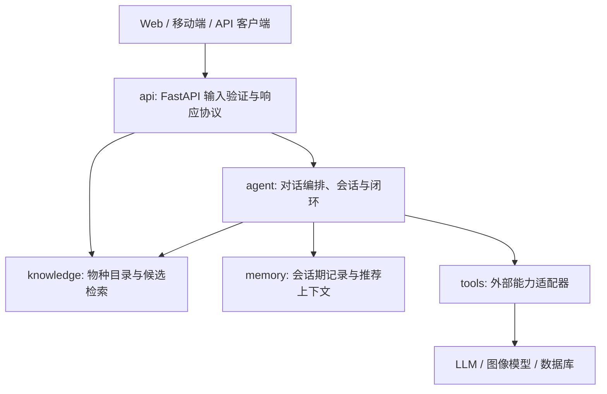

# nature-dex MVP 架构

## 目标与边界

nature-dex 是面向儿童自然观察的知识陪伴服务。MVP 交付一个可靠闭环：**文字描述 → 候选物种 → 儿童化讲解与安全提示 → 观察记录 → 基础推荐**。

当前版本刻意不把规则检索伪装成视觉识别或通用 LLM 推理。文字候选必须有可复核的特征证据；证据不足时返回不确定状态和澄清问题。图片识别、持久化和 LLM 工具调用是后续可替换的适配器，不应污染领域层。

## 分层与依赖

依赖规则：

- `api` 只负责 HTTP 协议、鉴权和输入校验；可调用 `agent` 与只读 `knowledge` 查询，不能直接读写 `memory`。
- `agent` 编排用户流程，依赖 `knowledge`、`memory` 和 `tools`。
- `knowledge` 是纯领域层：不依赖 FastAPI、Agent、数据库或外部模型。
- `tools` 用端口/适配器封装外部能力，绝不反向依赖 `agent`。
- `memory` 提供存储接口；当前为进程内实现，生产环境替换为 Redis 或数据库时不改变 Agent 调用方。

## 核心模型

[知识目录](../src/knowledge/species.py) 定义共享的 `Species` 聚合。它是识别、讲解、观察记录和推荐的唯一物种事实来源，包含：稳定 ID、中英文/学名、类型与分类、年龄分层解释、家长补充、安全提示、识别特征、澄清问题、季节地点标签和观察任务。

目录初始覆盖 30+ 个小区与公园常见物种。种名仅用于展示；跨模块关联必须优先使用稳定的 `species.id`。现有观察记录接口暂为兼容保留中文种名，迁移到持久化仓库时应增加 `species_id` 外键，并保留 `species_name_snapshot` 作为历史展示快照。

## 文字识别请求

`POST /api/v1/identify/text` 经过 Pydantic 校验后调用 `SpeciesCatalog.search_text()`：

1. 从描述中匹配物种的受控搜索词，按地点和季节补充上下文权重。
2. 只在命中特征证据时生成候选，并限制置信度上限为 0.90，避免错误表达为确定结论。
3. 无有效特征、或仅有弱上下文时返回空候选、`is_uncertain=true` 和澄清问题。
4. 每个候选输出区分特征、对应年龄层解释和安全提示；客户端不需要自行拼装安全策略。

这是可审计的基线。接入视觉模型后，应新增 `ImageIdentifier` 工具适配器来产生视觉候选，再由目录层合并候选与证据；不得在 API 路由中直接调用模型 SDK。

## 观察与推荐闭环

观察记录由 `ObservationRepository` 端口管理，当前的 `InMemoryObservationRepository` 仅用于本地开发与测试。记录以 `child_id` 隔离，并在已确认时关联目录中的稳定 `species_id`；待确认记录可以保留儿童的原始物种描述而不伪造物种 ID。`AgentCore` 基于目录的季节、地点和已观察物种生成推荐。

对外 API 有：

- `POST /api/v1/chat`：轻量对话与安全提醒；不承担结构化识别响应。
- `POST /api/v1/identify/text`：结构化文字候选。
- `POST /api/v1/observations`：保存已确认或待确认的观察记录，可提供 `child_id` 和 `species_id`。
- `GET /api/v1/children/{child_id}/observations`：读取儿童档案下最近保存的记录。
- `POST /api/v1/recommendations`：根据会话或显式 `child_id` 的记录返回下一步观察建议。

当前 `MemoryStore` 与 `InMemoryObservationRepository` 都是进程内实现，只适用于本地开发与测试；服务重启后数据会丢失，也不能横向扩展。下一步需实现 PostgreSQL 版 `ObservationRepository`，并定义 `ProfileRepository` 协议，避免业务代码绑定具体存储。

## 儿童安全不变量

- 任何识别都必须支持不确定结果，禁止无证据的确定性命名。
- 所有候选都携带安全提示；真菌、水边、刺、叮蜇或野生动物相关内容必须使用更严格提醒。
- 年龄分层在领域模型内维护，禁止由客户端根据成人文本简化。
- 外部模型返回内容必须先经过安全与置信度策略，再发送给儿童端。

## 演进计划

1. **完成**：结构化物种目录、可解释文字检索、带儿童档案与稳定 `species_id` 关联的内存观察/推荐闭环。
2. **下一步**：实现 PostgreSQL 仓储、儿童档案与认证；为观察记录添加受控的更新与删除能力。
3. **后续**：以工具适配器接入图片候选识别、上传对象存储与两轮澄清状态机。
4. **生产化**：JWT 身份认证、用户数据隔离、限流、结构化日志/Trace ID、指标与审计。

任何跨层依赖、存储模型或外部模型策略变化均应新增 ADR 并同步本文档。
